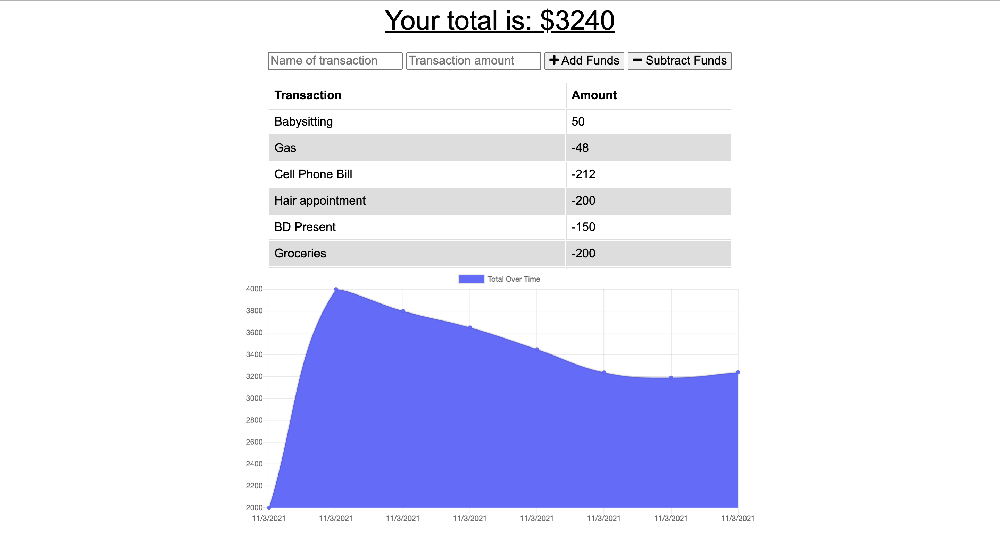
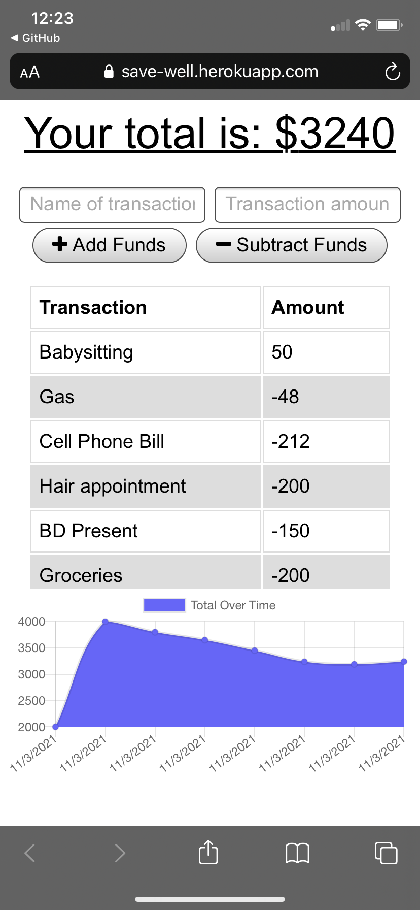

# SaveWell

https://save-well.herokuapp.com/

## Description 

Budget Tracker application is a Progressive Wb Application (PWA) that allows both online and offline access and functionality.

## Demo 

***

## Table of Contents
* [Technologies used](#technologies-used)
* [Usage](#Usage)
* [Contributions](#Contributions)
* [Credits](#Credits)
* [Contact](#Contact)

## Technologies used

  - HTML
  - CSS
  - JS
  - Node.js
  - Express.js
  - IndexedDB
  - PWA
  - Morgan
  - MongoDB
  - MongoDB Atlas
  - Mongoose
  - Heroku

## Usage

With this application users can track their withdrawals and deposits with or without a data/internet connection.

## Contributions
  *Alena Rehberger*

## Credits
  Thanks to Trilogy Education Services for providing a starter code for this application.

## Contact
  If you have any questions, feel free to cantact me at: 
  * GitHub: https://github.com/AlenaReh
  * Linkedin: https://www.linkedin.com/in/alena-rehberger/
  * E-mail: alenarehberger92@gmail.com
